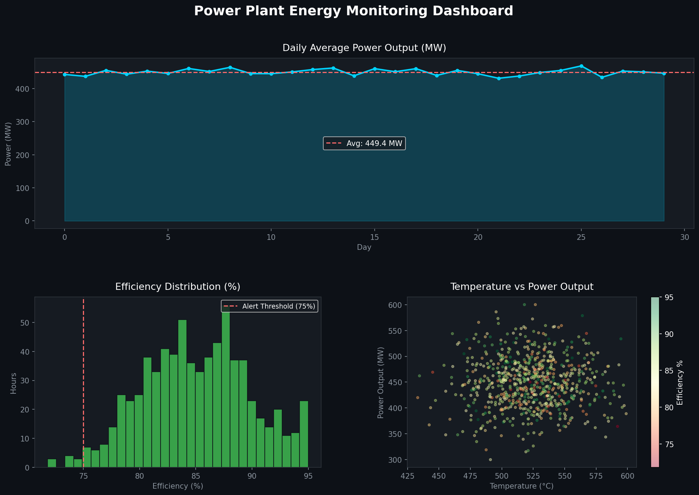

# Power-Plant-Energy-Monitoring
Python-based power plant energy monitoring and data analysis dashboard

# ⚡ Power Plant Energy Monitoring Dashboard

A Python-based data analysis project that simulates and monitors
real-time power plant performance metrics using sensor data.

## 📌 Project Overview
This project analyzes 30 days (720 hours) of power plant operational
data to track performance, detect anomalies, and visualize key metrics
through an interactive dashboard.

## 📊 Dashboard Preview

## 🔍 Key Features
- Simulated 720 hours of real-world power plant sensor data
- Tracked Power Output (MW), Temperature (°C), Fuel Consumption & Efficiency
- Automated anomaly detection for low efficiency hours (< 75%)
- Visual dashboard with 3 analytical charts
- Exportable PNG dashboard report

## 🛠️ Tools & Technologies
| Tool | Purpose |
|------|---------|
| Python | Core programming |
| Pandas | Data manipulation & analysis |
| NumPy | Numerical computations |
| Matplotlib | Data visualization & dashboard |

## 📈 Key Results
- Average Power Output: **449.45 MW**
- Average Efficiency: **85.09%**
- Low Efficiency Alerts: **10 hours flagged**
- Total Fuel Consumed: **86,712.85 tons**
